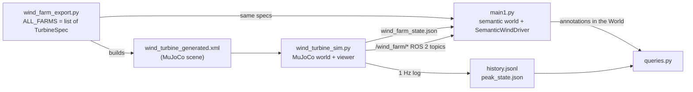

# wind_farm_semantic_digital_twin

## Contents

- [How it fits together](#how-it-fits-together)
- [Requirements](#requirements)
- [Quick start](#quick-start)
- [Querying the twin](#querying-the-twin)
- [Command-line reference](#command-line-reference)


---

## How it fits together

There are two worlds holding the same farm, and one source of truth for the layout.



- **`wind_farm_export.py`** is the single source of truth for the layout. It holds the
  `TurbineSpec` lists and generates the MuJoCo XML from them.
- **`wind_turbine_sim.py`** loads that XML and runs the physics: nacelles yaw to face the
  wind, rotors ramp up and down, power and energy accumulate. This is the ground truth.
- **`main1.py`** builds the *same* farm as a semantic `World` (bodies, connections,
  annotations) and animates it with `SemanticWindDriver`. It mirrors the sim rather than
  recomputing: wind arrives through a small JSON state file, rpm/power/energy through ROS 2
  topics. Without the sim running it falls back to its own wind-driven model, so it also
  works standalone.
- **`queries.py`** answers questions by reading annotations out of the `World` — never by
  reaching into the driver's internals. History questions read the 1 Hz log instead, since
  the world only ever represents *now*.

Both sides import the same `turbine_formulas.py`, so the two worlds cannot drift apart.

---

## Requirements

| What | Why | Needed for |
|---|---|---|
| Python 3.10+ | `list[...]` annotations, `kw_only` dataclasses | everything |
| `numpy` | the formulas | everything |
| `mujoco` | the simulation and viewer | `wind_turbine_sim.py` |
| ROS 2 (`rclpy`, `std_msgs`) | topics between the two worlds | `main1.py`, `--publish` |
| [`semantic_digital_twin`](https://github.com/cram2/semantic_digital_twin) | the semantic World, bodies, annotations | `main1.py`, `queries.py` |
| RViz 2 | seeing the semantic world | optional |

```bash
pip install numpy mujoco
# ROS 2 and semantic_digital_twin: follow their own install instructions,
# then source your ROS 2 workspace before running main1.py
source /opt/ros/<distro>/setup.bash
```

MuJoCo is not needed if you only want the semantic world — see
[standalone mode](#3-semantic-world-standalone-no-mujoco).

---

## Quick start

### 1. MuJoCo only — see the turbines turn

```bash
python3 wind_farm_export.py --launch --wind 8
```

That writes `wind_turbine_generated.xml` from the farms enabled in `ALL_FARMS` and opens
the viewer at 8 m/s. Press `S` then the arrow keys to change wind speed, `D` then the
arrows for direction, `T` then the arrow keys for the Temperature and `G` then the
arrows for the Grid Limit. Or add `--ui` for the browser control panel instead of the keys.


### 2. Both worlds — the actual digital twin

Two terminals, both with ROS 2 sourced.

```bash
# terminal 1 — MuJoCo, publishing its state
python3 wind_farm_export.py --launch --publish --ui --wind 8

# terminal 2 — the semantic world, following it
python3 main1.py
```

`main1.py` keeps running and prints how to talk to it. The semantic turbines now yaw and
spin with the MuJoCo ones, and their rpm/power/energy are the values MuJoCo published, not
a second estimate. Open RViz 2 and add a **Marker** display on `/viz_marker` to see it.

### 3. A timed run you can ask questions about afterwards

```bash
python3 wind_farm_export.py --launch --publish --time 120
```

Runs 120 s, logs a sample every second, then closes. See
[Querying the twin](#querying-the-twin).

---

## Querying the twin

`queries.py` is the query API. Every live query takes either the `World` or the driver.

```bash
python3 -i -c "from queries import *; world, driver = main()"
```

```python
# environment
wind_speed(world)                 # 8.0
wind_direction(world)             # 225.0   (bearing the wind comes FROM)
temperature(world)                # 15.0
is_environment_live(world)        # False if nothing is updating the world

# one turbine
turbine_rpm(world, "Farm_Mine_1")
turbine_power(world, "Farm_Mine_1")
turbine_energy(world, "Farm_Mine_1")
turbine_nacelle_yaw_deg(world, "Farm_Mine_1")
is_turbine_spinning(world, "Farm_Mine_1")
turbine_status(world, "Farm_Mine_1")       # all of the above in one dict

# the whole farm
turbine_names(world)
total_power(world)
total_energy(world)
spinning_turbines(world)
idle_turbines(world)
fastest_turbine(world)                     # ("Farm_Mine_2", 7.2)
most_powerful_turbine(world)
least_powerful_moving_turbine(world)

# structure and materials
part_material(world, "Farm_Mine_1_tower")  # "steel"
bill_of_materials(world)                   # every part -> material

# a printable snapshot of every annotation
print(annotation_report(world))

# the peak, kept across restarts
print(peak_power_report(driver))
```

### History queries

These read `history.jsonl` rather than the world, because they are about time spans that
have already passed. Pass no source and they use the default file.

```python
spinning_intervals("Farm_Mine_1")      # [{'start_s':.., 'end_s':.., 'duration_s':..}, ...]
was_spinning_at("Farm_Mine_1", 42.0)   # True/False
highest_wind_speed()                   # (timestamp, time_s, speed)
wind_speed_for_power(5.0)              # at what wind speed did the farm make 5 MW?
time_for_energy(100.0)                 # when did it first reach 100 kWh?
```

---

## Command-line reference

### `wind_farm_export.py` — build the scene, optionally launch

| Flag | Default | Meaning |
|---|---|---|
| `--out PATH` | `wind_turbine_generated.xml` | where to write the MJCF |
| `--farm NAME` | all | which farm(s); repeatable, short names work (`--farm south --farm west`) |
| `--launch` | off | open the viewer after exporting |
| `--headless N` | — | run N seconds with no viewer instead |
| `--wind`, `--direction` | 8, 0 | initial wind for the launched sim |
| `--gridLimit MW` | none | cap the farm |
| `--yaw-rate`, `--rotor-accel` | 10 deg/s, 1 rpm/s | how fast nacelles slew and rotors ramp |
| `--temp C` | 15 | initial air temperature |
| `--publish` | off | launch the sim with ROS 2 publishing |
| `--ui`, `--ui-port` | off, 8080 | launch with the browser panel |
| `--time N`, `--history-file` | — | timed run with 1 Hz logging |
| `--sky FILE`, `--ground FILE` | procedural | textures; `assets/skybox.png` and `assets/ground.png` are included |
| `--meshes DIR` | primitives | use OBJ parts instead of boxes and cylinders (needs `base/tower/nacelle/spinner/blade/blade_tip.obj` in DIR) |


So to start a full run with all the futures:
```python
python wind_farm_export.py --ui --wind 0 --direction 0 --temp 15 --gridLimit 5000 --publish --launch --sky assets/skybox.png --ground assets/ground.png --meshes meshes --time 400
```
